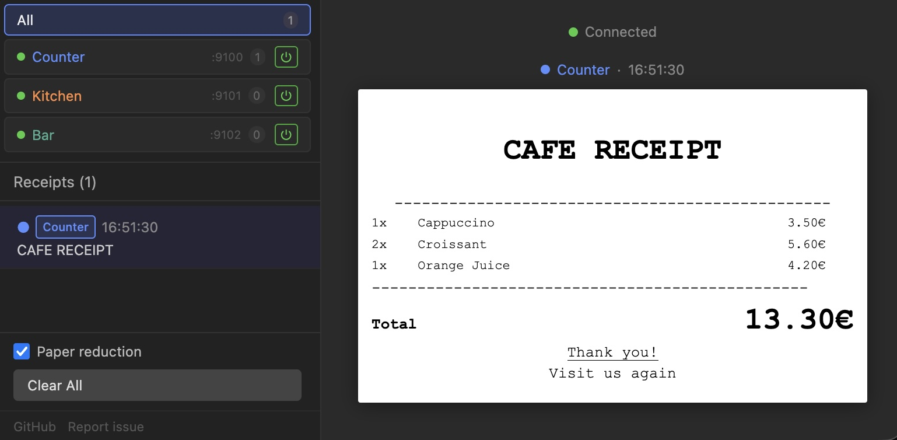

[](https://www.npmjs.com/package/escpos-emulator)

# escpos-emulator



A lightweight ESC/POS thermal receipt printer emulator for development and testing. Receives raw ESC/POS byte streams over TCP (like a real printer), parses them, and provides:

- **Live HTML preview** — receipts render in your browser as they arrive
- **REST API** — retrieve and validate receipt content in automated tests
- **WebSocket** — real-time updates pushed to connected browsers
- **Multiple printers** — run several virtual printers on different TCP ports, each with its own receipt view

Currently emulates an **Epson TM-M30III** (80mm paper, Font A: 42 chars/line, Font B: 56 chars/line).

## Quick Use

```bash
npx escpos-emulator          # no install, just run
npm i -g escpos-emulator     # or install globally
escpos-emulator              # then run anytime
```

### Docker

Single printer (default):

```bash
docker run -p 9100:9100 -p 3000:3000 ghcr.io/lezram/escpos-emulator
```

Multiple printers — expose one host port per TCP printer port, then pass the `PRINTERS` config:

```bash
docker run \
  -p 3000:3000 \
  -p 9100:9100 \
  -p 9101:9101 \
  -e PRINTERS='[{"id":"counter","name":"Counter","tcpPort":9100},{"id":"kitchen","name":"Kitchen","tcpPort":9101}]' \
  ghcr.io/lezram/escpos-emulator
```

> Each printer `tcpPort` in the JSON must match a `-p <host>:<container>` port mapping so the POS app can reach it.

## Quick Start (from source)

```bash
npm ci
npm run dev
```

- **TCP printer**: `localhost:9100` — point your POS app here
- **Web UI**: `http://localhost:3000` — live receipt viewer
- **API**: `http://localhost:3000/api/printers` — JSON access

## Test Print

```bash
npm run test-print
```

Sends a sample formatted receipt to verify the emulator works.

## Configuration

### Single printer

| Variable | Default | Description |
|----------|---------|-------------|
| `TCP_PORT` | `9100` | Port the virtual printer listens on |
| `HTTP_PORT` | `3000` | Port for web UI and REST API |
| `PRINTER_MODEL` | `TM-M30III` | Printer model to emulate |
| `PRINTER_NAME` | `Printer` | Display name shown in the UI |

### Multiple printers

Set `PRINTERS` to a JSON array. Each entry defines one virtual printer. When `PRINTERS` is set, the single-printer variables above are ignored.

```bash
PRINTERS='[
  {"id":"counter", "name":"Counter",  "tcpPort":9100},
  {"id":"kitchen", "name":"Kitchen",  "tcpPort":9101},
  {"id":"bar",     "name":"Bar",      "tcpPort":9102, "model":"TM-M30III"}
]' escpos-emulator
```

| Field | Required | Description |
|-------|----------|-------------|
| `id` | yes | Unique identifier used in API paths |
| `name` | yes | Display name shown in the UI tab |
| `tcpPort` | yes | TCP port this printer listens on |
| `model` | no | Printer model (default: `TM-M30III`) |

The web UI shows a tab per printer. Selecting a tab switches the receipt list and the online/offline toggle to that printer.

## REST API

### Printer list

| Method | Endpoint | Description |
|--------|----------|-------------|
| GET | `/api/printers` | All printers with id, name, tcpPort, enabled state |

### Per-printer endpoints

Replace `:id` with the printer `id` from the config.

| Method | Endpoint | Description |
|--------|----------|-------------|
| GET | `/api/printers/:id/receipts` | All stored receipts for this printer |
| GET | `/api/printers/:id/receipts/last` | Most recent receipt |
| GET | `/api/printers/:id/receipts/:receiptId` | Single receipt by ID |
| DELETE | `/api/printers/:id/receipts` | Clear all receipts for this printer |
| GET | `/api/printers/:id/status` | `{ enabled: true\|false }` |
| POST | `/api/printers/:id/toggle` | Toggle printer on/off |

## Supported ESC/POS Commands

| Command | Bytes | Function |
|---------|-------|----------|
| ESC @ | `1B 40` | Initialize printer |
| ESC ! | `1B 21 n` | Select print mode (font/bold/size/underline) |
| ESC - | `1B 2D n` | Underline on/off |
| ESC 2 | `1B 32` | Default line spacing |
| ESC 3 | `1B 33 n` | Set line spacing |
| ESC E | `1B 45 n` | Bold on/off |
| ESC M | `1B 4D n` | Select font (A/B) |
| ESC R | `1B 52 n` | International charset |
| ESC a | `1B 61 n` | Justification (left/center/right) |
| ESC d | `1B 64 n` | Feed n lines |
| ESC t | `1B 74 n` | Select code table |
| ESC p | `1B 70 m t1 t2` | Cash drawer pulse |
| GS ! | `1D 21 n` | Character size (width/height multiplier) |
| GS B | `1D 42 n` | Reverse print on/off |
| GS V | `1D 56 m` | Paper cut |
| GS v 0 | `1D 76 30 ...` | Raster bit image (skipped) |
| GS ( k | `1D 28 6B ...` | 2D codes / QR (skipped) |
| GS k | `1D 6B m ...` | Barcode (skipped) |

Unsupported commands are gracefully skipped with a console warning.

## Adding a Printer Model

Edit `src/printer-model.ts` and add a new object conforming to `PrinterModel`:

```typescript
export const MY_PRINTER: PrinterModel = {
  name: 'My-Printer',
  vendor: 'Vendor',
  paperWidthMm: 80,
  printableWidthMm: 72,
  dpi: 203,
  fonts: {
    A: { charsPerLine: 42, widthPx: 12, heightPx: 24 },
    B: { charsPerLine: 56, widthPx: 9, heightPx: 24 },
  },
  defaultFont: 'A',
  defaultCodePage: 'iso-8859-15',
};
```

Then add it to the `models` record and set `model` to `My-Printer` in the printer config.

## Architecture

```
POS App ──TCP:9100──► EscPosParser ──► ReceiptStore (printer 1) ──┐
POS App ──TCP:9101──► EscPosParser ──► ReceiptStore (printer 2) ──┼──► HTTP API + WebSocket ──► Browser
POS App ──TCP:910N──► EscPosParser ──► ReceiptStore (printer N) ──┘
```

## License

MIT
